<h1 align="center">Gianluca Bavelloni</h1>

<b>MSc Business Analytics & AI</b> · Switzerland

I build machine-learning models and AI products where data drives decisions with real financial impact: 
credit and fraud risk, pricing, recommender systems and LLM agents.

  
  
  
  
  
  
  
  
  

<picture>
  <source media="(prefers-color-scheme: dark)" srcset="assets/roadmap-dark.svg">
  
</picture>

### Projects

| Project | What it does | Stack |
|---|---|---|
| **[Credit Decision](https://github.com/GianlucaBave/final-data-finance)** | Personal-loan approval model; **tied #1** on the public leaderboard of the ESADE Kaggle competition (0.8565 accuracy), after catching a planted target leak | CatBoost, LightGBM, XGBoost |
| **[Fynn](https://github.com/dacobri/fynn-talk-to-your-finances)** · team project | AI copilot for personal finance: a Claude agent answers money questions with live SQL and charts over all your bank accounts | Next.js, FastAPI, LangChain, Claude |
| **[Tunescape](https://github.com/GianlucaBave/tunescape)** · [demo](https://tunescape.vercel.app) | Interactive atlas of 15,350 artists comparing 8 recommender algorithms side by side | Python, Next.js, deck.gl |
| **[CrowdLoop AI](https://github.com/GianlucaBave/DJ_Assistant_streamlit)** · [demo](https://dj-assistant-streamlit.vercel.app) | Agentic DJ copilot: a Claude agent drives the deck via tool use over a RAG-indexed track library | Claude API, RAG, Web Audio |
| **[iPhone Deal-Finder](https://github.com/GianlucaBave/Final-Advanced-Python-Project)** | Fair-value model for second-hand iPhones on 13,745 price records (8,262 scraped live) with a buy / hold / skip call | Python, scraping, LightGBM |
| **[CV Job Fit Checker](https://github.com/GianlucaBave/Seminar-challenge)** · [demo](https://seminar-challenge.vercel.app) | Scores a CV against a job offer and suggests how to tailor it | Node.js, Gemini API |
| **[ArtSync](https://github.com/GianlucaBave/artsync)** · [demo](https://artsync-pi.vercel.app) | Prototype marketplace for art commissions with a generative-AI concept preview | Next.js, Tailwind |

<picture>
  <source media="(prefers-color-scheme: dark)" srcset="assets/techmap-dark.svg">
  
</picture>

<picture>
  <source media="(prefers-color-scheme: dark)" srcset="assets/career-dark.svg">
  
</picture>

<b>Experience and education in detail</b>

**Global Payments**, Risk Analyst, graduate project · Barcelona · 2026  
Predictive ML model on 470k+ merchants to automate fraud and default detection, with transactional features such as chargeback ratios and insolvency indicators.

**Fineco Bank**, Private Banking Intern · Milan · 2025  
Portfolio construction for HNW clients; streamlined risk profiling, cutting interview time by 20%.

**HMY Group**, Project Manager Intern · Milan · 2024  
FP&A on $1–4M retail projects across 10 clients; built an Excel automation for Gantt planning.

**Neptun S.r.l.**, Business Operations Associate · Milan · 2021–2025  
AI-assisted database standardisation (client records +300%), financial analysis, KPI monitoring and monthly close support.

**ESADE Business School**, MSc in Business Analytics · 2025–2026  
Machine Learning, Cloud Computing, Big Data, AI-driven decision-making

**USI, Università della Svizzera italiana**, BA in Economics, Major in Finance · 2021–2024  
Thesis 9/10 · DCF Valuation 9.5/10 · Advanced Statistics 9.5/10

