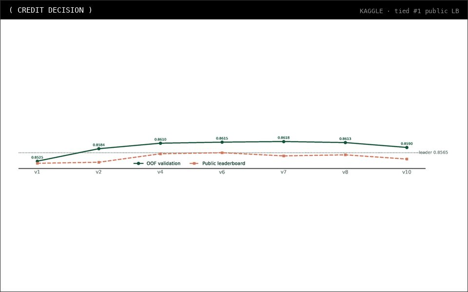
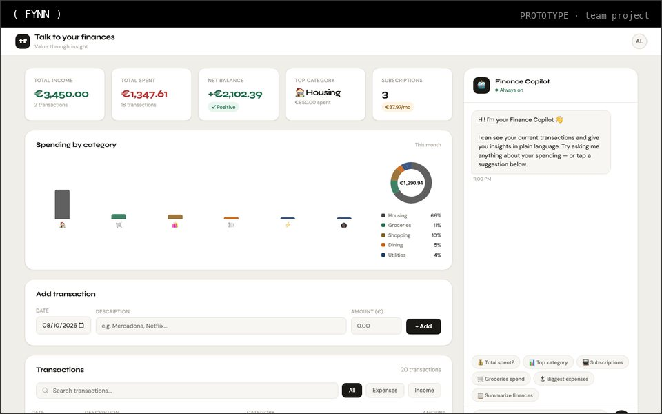
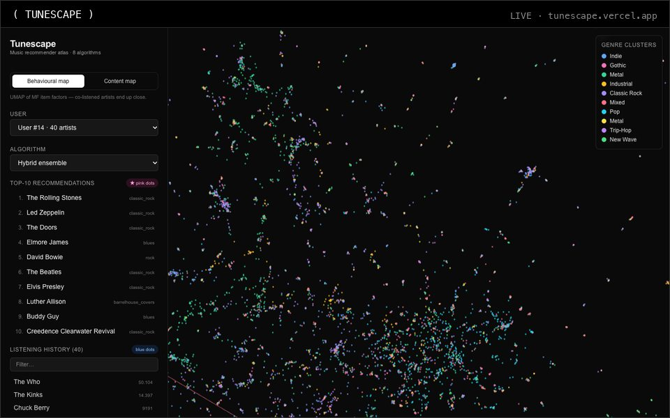
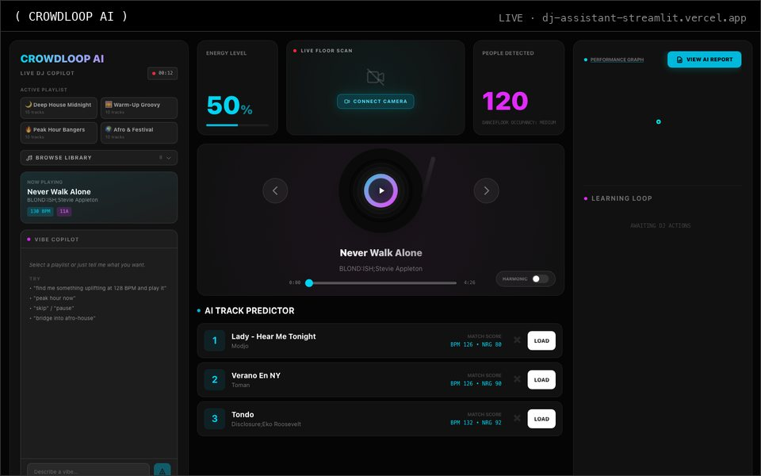
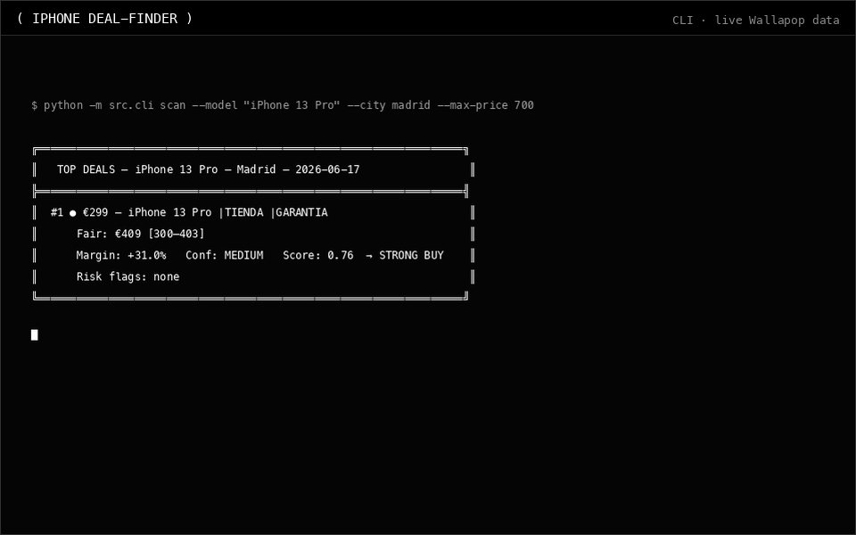
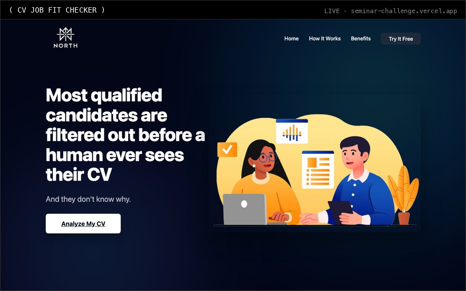
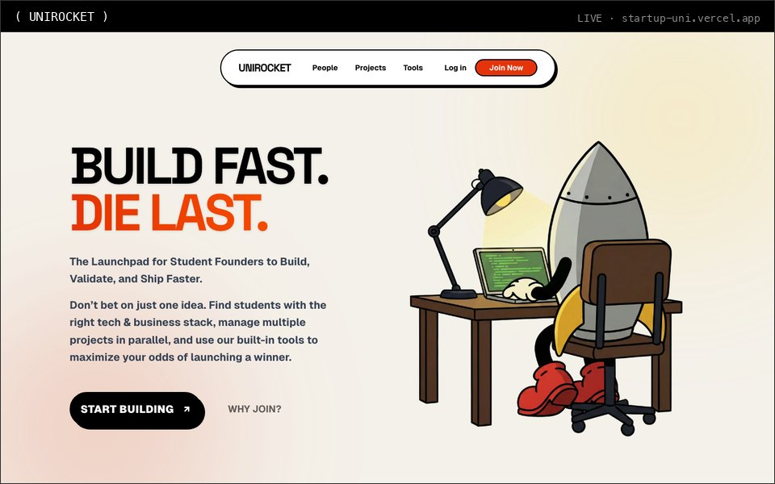
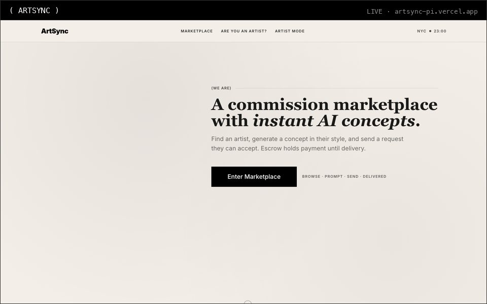

  
  
  
  
  
  
  
  

### `( SELECTED WORK )`

<table>
<tr>
<td width="50%" valign="top">

#### [CREDIT DECISION](https://github.com/GianlucaBave/final-data-finance)
`// #1 PUBLIC LEADERBOARD` 
Personal-loan approval model for a Kaggle competition. Tied first at 0.8565 accuracy after catching a planted target leak. 
`CATBOOST` `LIGHTGBM` `XGBOOST`

</td>
<td width="50%" valign="top">

#### [FYNN](https://github.com/dacobri/fynn-talk-to-your-finances)
`// TEAM PROJECT` 
AI copilot for personal finance: a Claude agent answers money questions with live SQL and charts over every bank account. 
`NEXT.JS` `FASTAPI` `LANGCHAIN` `CLAUDE`

</td>
</tr>
<tr>
<td width="50%" valign="top">

#### [TUNESCAPE](https://github.com/GianlucaBave/tunescape) · [demo](https://tunescape.vercel.app)
`// RECOMMENDER SYSTEMS` 
Interactive atlas of 15,350 artists comparing 8 recommender algorithms side by side on one map. 
`PYTHON` `NEXT.JS` `DECK.GL`

</td>
<td width="50%" valign="top">

#### [CROWDLOOP AI](https://github.com/GianlucaBave/DJ_Assistant_streamlit) · [demo](https://dj-assistant-streamlit.vercel.app)
`// AGENTIC AI` 
DJ copilot: a Claude agent drives the deck through tool use over a RAG-indexed track library. 
`CLAUDE API` `RAG` `WEB AUDIO`

</td>
</tr>
<tr>
<td width="50%" valign="top">

#### [IPHONE DEAL-FINDER](https://github.com/GianlucaBave/Final-Advanced-Python-Project)
`// PRICING MODEL` 
Fair-value model for second-hand iPhones on 13,745 price records, 8,262 scraped live, with a buy / hold / skip call. 
`PYTHON` `SCRAPING` `LIGHTGBM`

</td>
<td width="50%" valign="top">

#### [CV JOB FIT CHECKER](https://github.com/GianlucaBave/Seminar-challenge) · [demo](https://seminar-challenge.vercel.app)
`// LLM TOOL` 
Scores a CV against a job offer and suggests how to tailor it. 
`NODE.JS` `GEMINI API`

</td>
</tr>
<tr>
<td width="50%" valign="top">

#### UNIROCKET · [demo](https://startup-uni.vercel.app)
`// SAAS · CODE PRIVATE` 
Platform for student founders: find teammates, pitch ideas, raise funds and watch the market with a built-in radar. 
`NEXT.JS` `SUPABASE` `STRIPE`

</td>
<td width="50%" valign="top">

#### [ARTSYNC](https://github.com/GianlucaBave/artsync) · [demo](https://artsync-pi.vercel.app)
`// PROTOTYPE` 
Marketplace for art commissions with a generative-AI concept preview. 
`NEXT.JS` `TAILWIND`

</td>
</tr>
</table>

